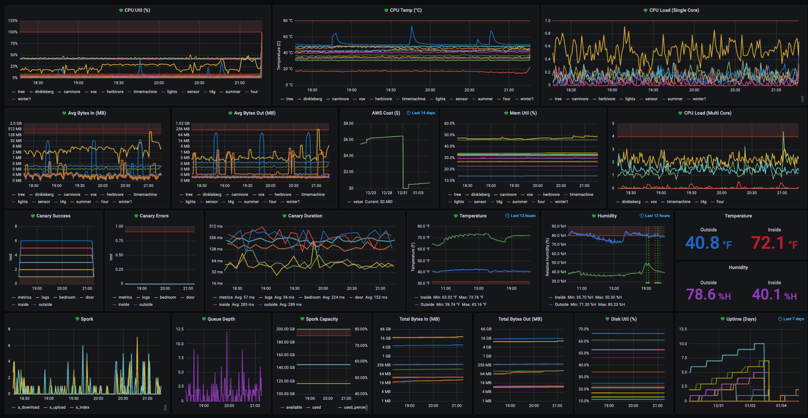

# Metrics



* This repo is a simple metrics-collection script to collect CPU/Memory/Disk/Temp metrics and persist them in a MySQL DB to be displayed on a Grafana server. 

* The script is triggered via cron every 1 or 5 (or whatever interval you want) minutes. 


### Example Configuration File:

```
from mysql.connector.constants import ClientFlag
import mysql.connector

SSL_CONFIG = {
    'user': 'grafana_db_user',
    'password': "password",
    'host': "host",
    'port': 3600,
    'database': 'graphing_data',
    'client_flags': [ClientFlag.SSL],
    'ssl_ca': '/path/to/CA.crt',
}
db = mysql.connector.connect(**SSL_CONFIG)
cursor = db.cursor()

HOSTNAME = "EXAMPLE_HOST"
DISK_DRIVES = ['/', '/System/Volumes/Data']
TEMP = False  # Temperature does not work on Mac
```

### Example Cron Expression:

```
*/1 * * * * /usr/bin/python3 -u /home/barney/metrics/collect_metrics.py >> /home/barney/metrics/metrics.log
```

